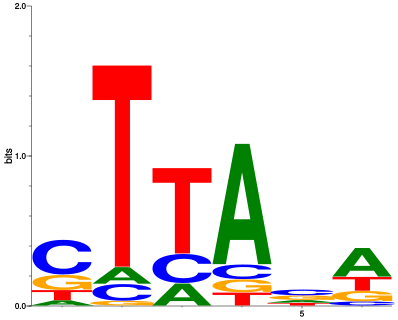
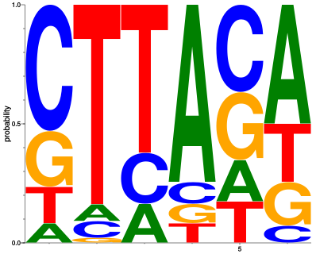

seqLogo: Python port of Bioconductor's `seqLogo` served by [WebLogo](http://weblogo.threeplusone.com/)
===============================

Overview
--------

In the field of bioinformatics, a common task is to look for sequence motifs at 
different sites along the genome or within a protein sequence. One aspect of this
analysis involves creating a Position Weight Matrix (PWM). The formal format for
a PWM file can be found [here](http://bioinformatics.intec.ugent.be/MotifSuite/pwmformat.php).

In short, a PWM file has `M` number of rows by `N` number of columns, where the
number of rows is the number of positions within the target sequence, and the number
of columns is the number of possible letters that can be found in the sequence.

Each item within the PWM is the probability of that given letter being seen at that
given position. This is often generated in a frequentist fashion. If a pipeline
tallies all observed letters at each position, this is called a Position Frequency Matrix (PFM).

`seqLogo` can use both PWMs and PFMs as entry points for analysis (from a file or in array formats)
and, subsequently, plot the sequence logos.

`seqLogo` was written to support BIOINF 529 :Bioinformatics Concepts and Algorithms
at the University of Michigan in the Department of Computational Medicine & Bioinformatics.

`seqLogo` attempts to blend the user-friendly api of Bioconductor's [seqLogo](http://bioconductor.org/packages/release/bioc/html/seqLogo.html) 
and the rendering power of the [WebLogo](http://weblogo.threeplusone.com/)Python API.

`seqLogo` can handle numerous alphabets (e.g. DNA, RNA, Amino Acid), all of which
can be extended, reduced, or ambiguous.

`seqLogo` can also render sequence logos in a number of formats:
* svg (default)
* eps
* pdf
* jpeg
* bmp
* png

All plots can be rendered in 4 different sizes:
* small: 3.54" wide
* medium: 5" wide
* large: 7.25" wide
* xlarge: 10.25" wide

### Notes:
* For best results, implement `seqLogo` within a IPython/Jupyter environment (for inline plotting purposes).
* Initially written for Python 3.7. No other runtime has been tested.

Installation / Usage
--------------------

## Minimal Requirements:
1. `numpy`
2. `pandas`
3. `weblogo`

**Note**: it is strongly encouraged that `jupyter` is installed as well.

## `conda` environment:

To produce the ideal virtual environment that will run `seqLogo` on a `conda`-based
build, clone the repo or download the environment.yml within the repo. Then run the following
command:

```bash

$ conda env create -f environment.yml

```

To install using pip:

```bash

$ pip install seqLogo

```
Or clone the repo:

```bash

$ git clone https://github.com/betteridiot/seqLogo.git
$ python setup.py install

```

Quickstart
----------

## Importing

```python

import numpy as np
import pandas as pd
import seqLogo

```

## Generate some PWM data (without frequency data)

For many demonstrations that speak to PWMs, they are often started with PWM data.
Many packages preclude sequence logo generation from this entry point. However,
`seqLogo` can handle it just fine. One point to make though is that if no count 
data is provided, `seqLogo` just generates *pseudo-count* data by multiplying the
probabilities by 100. This is **only** for `weblogolib` comparability.

```python

# Setting seed for demonstration purposes
>>> np.random.seed(42)

# Making a fake PWM
>>> random_pwm = np.random.dirichlet(np.ones(4), size=6)
>>> pwm = seqLogo.Pwm(random_pwm)
>>> pwm
          A         C         G         T
0  0.082197  0.527252  0.230641  0.159911
1  0.070375  0.070363  0.024826  0.834435
2  0.161962  0.216972  0.003665  0.617401
3  0.735638  0.098290  0.082638  0.083434
4  0.179898  0.368931  0.280463  0.170708
5  0.498510  0.079138  0.182004  0.240349

```
## Generate some frequency data and convert to PWM
Sometimes the user has frequency data instead of PWM. To construct a `Pwm` instance
that automatically computes Information Content and PWM values, the user can use
the `seqLogo.pfm2pwm()` function.

```python

# Setting seed for demonstration purposes
>>> np.random.seed(42)

# Making some fake Position Frequency Data (PFM)
>>> pfm = pd.DataFrame(np.random.randint(0, 36, size=(8, 4)))

# Convert to Position Weight Matrix (PWM)
>>> pwm = seqLogo.pfm2pwm(pfm)
>>> pwm
          A         C         G         T
0  0.405797  0.202899  0.101449  0.289855
1  0.300000  0.366667  0.166667  0.166667
2  0.277108  0.421687  0.277108  0.024096
3  0.283784  0.013514  0.310811  0.391892
4  0.015625  0.312500  0.500000  0.171875
5  0.214286  0.244898  0.265306  0.275510
6  0.405405  0.378378  0.054054  0.162162
7  0.416667  0.166667  0.354167  0.062500

```

## Plot the sequence logo with information content scaling

```python

# Setting seed for demonstration purposes
>>> np.random.seed(42)

# Making a fake PWM
>>> random_pwm = np.random.dirichlet(np.ones(4), size=6)
>>> pwm = seqLogo.Pwm(random_pwm)
>>> seqLogo.seqLogo(pwm, ic_scale = False, format = 'svg', size = 'medium')

```

The above code will produce:



## Plot the sequence logo with no information content scaling

```python

# Setting seed for demonstration purposes
>>> np.random.seed(42)

# Making a fake PWM
>>> random_pwm = np.random.dirichlet(np.ones(4), size=6)
>>> pwm = seqLogo.Pwm(random_pwm)
>>> seqLogo.seqLogo(pwm, ic_scale = False, format = 'svg', size = 'medium')

```

The above code will produce:



Contributing
------------

Please see our contribution guidelines [here](https://github.com/betteridiot/seqLogo/blob/master/CONTRIBUTING.md)

Acknowledgments/Citations
-------------------------

1. Bembom O (2018). seqLogo: Sequence logos for DNA sequence alignments. R package version 1.48.0.
2. Crooks GE, Hon G, Chandonia JM, Brenner SE WebLogo: A sequence logo generator,
Genome Research, 14:1188-1190, (2004).